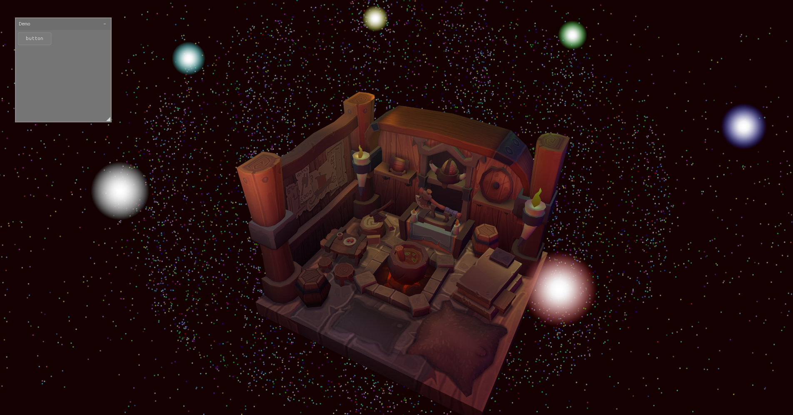

# Obsidian

Obsidian is a custom game engine built on the Vulkan graphics API. It was created to learn C++ and Vulkan/graphics programming concepts, with the long-term goal of enabling the development of complex games, including open-world titles with procedural generation.

Note: This project is in an early stage and should evolve significantly in the coming months. Currently, most of the core Vulkan implementation is heavily inspired by these two tutorials:
- [Official Vulkan Tutorial](https://vulkan-tutorial.com/)
- [Vulkan C++ playlist by Brendan Galea](https://www.youtube.com/watch?v=Y9U9IE0gVHA&list=PL8327DO66nu9qYVKLDmdLW_84-yE4auCR)

# Preview

Here is a preview as of now of a scene - including a 3D model with a texture and lighting:

# Key Features and main components

At this stage, Obsidian includes some of the foundational components typical of game engines:
- **Vulkan-based rendering pipeline** with support for textures, mipmaps, swap chains, Abstracts Vulkan zzzzzzzzzzzzzzzzzzzzzzzzzzzzzzdevice initialization, physical/logical device selection, and queue family management
- **3D renderer**, including a window, 3D model loading, camera systems (orthographic/perspective projections), shaders, and basic rendering utilities.

# Future Plans

Obsidian aims to expand with the following features:
- **User Interface** : traditional game engine-style UI components for editor and in-game interfaces,
- **Entity Component System** for efficient game object management,
- **Compute Shaders** GPU-accelerated computations for simulations and effects,
- **Language Model Integration**: support for AI-driven features, such as dynamic dialogue, procedural storytelling, or NPC behaviors using language models,
- **3D procedural generation support**: tools for voxel-based worlds,
- **Post-processing effects**,
- **Raytracing**: potential addition for advanced lighting.